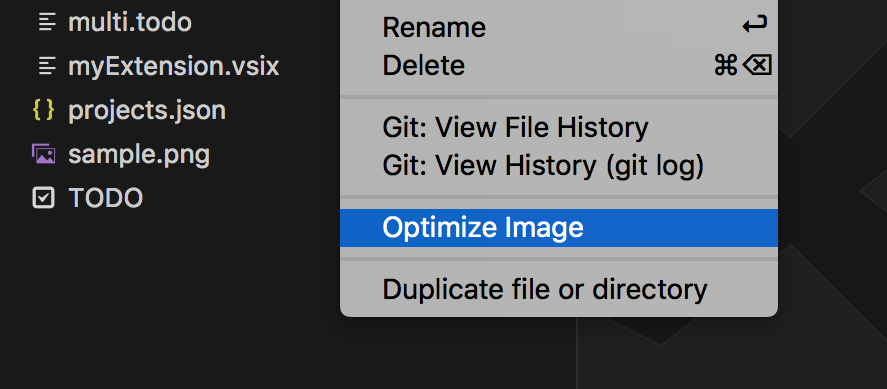

# Optimize Images

<p align="center">
  
</p>

Optimize one or all the images in your project using your favorite app.

## Install

Follow the instructions in the [Marketplace](https://marketplace.visualstudio.com/items?itemName=fabiospampinato.vscode-optimize-images), or run the following in the command palette:

```shell
ext install fabiospampinato.vscode-optimize-images
```

## Usage

It adds 1 command to the command palette:

```js
Optimize Images: Optimize All // Optimize all images found in the current project
```

You can also right click a single image and only optimize that one.

## Settings

```js
{
  "optimizeImages.app": "", // Name of the app to use for optimizating the images
  "optimizeImages.appOptions": [], // An array of options to be passed to the app on execution. You can use the array item "[filepath]" as a placeholder for the filepath to the currently processed file
  "optimizeImages.imageRegex": ".*\\.(png|gif|jpe?g)$", // Regex used for matching images. Requires double escaping
  "optimizeImages.searchDepth": 10, // Maximum depth to look at when searching images
  "optimizeImages.searchStartingPath": ".", // Path relative to the root where to start searching images
  "optimizeImages.searchIgnoreFolders": [".git", ...] // Ignore these folders when searching images
}
```

## Recommended Apps

#### Mac

- [ImageOptim](https://imageoptim.com/mac): Removes bloated metadata. Saves disk space & bandwidth by compressing images without losing quality.

#### Windows

- [IOptimizer](https://github.com/ymg2006/Image-Optimizer): Both lossless and lossy  PNG, JPG and GIF image optimizer. Usage instructions included in its readme.

#### Linux

- [Trimage](https://trimage.org): Lossless PNG and JPG image optimizer. Images are compressed on the highest available compression levels, and EXIF and other metadata is removed.

## Demo



## Contributing

If you found a problem, or have a feature request, please open an [issue](https://github.com/fabiospampinato/vscode-optimize-images/issues) about it.

If you want to make a pull request you can debug the extension using [Debug Launcher](https://marketplace.visualstudio.com/items?itemName=fabiospampinato.vscode-debug-launcher).

## License

Icon: GPL v2 © [ImageOptim](https://github.com/ImageOptim/ImageOptim)

Extension: MIT © Fabio Spampinato
